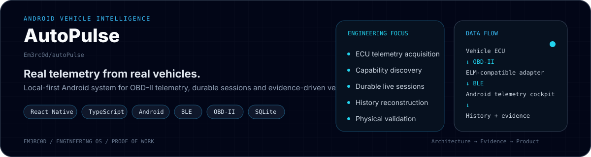
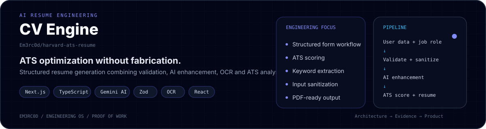
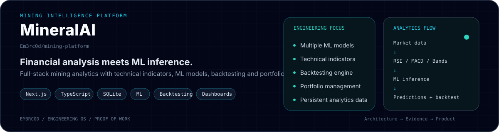
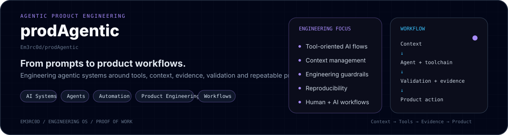

<!--
Eduardo Merino | Em3rc0d
Full Stack Developer | Software Engineer | AI & Product Engineering
TypeScript | JavaScript | Java | Python | SQL
Next.js | Angular | React | React Native | Spring Boot | Node.js | Express
PostgreSQL | PostGIS | MongoDB | SQLite
Docker | Vercel | Linux | Git | GitHub
AI Integration | LLM Applications | Machine Learning | Agentic Systems | Automation
Systems Engineering | Universidad Nacional Mayor de San Marcos | Peru
-->

<p align="center">
  
</p>

<h1 align="center">Software that goes beyond the demo.</h1>

<p align="center">
  <strong>Full Stack Developer · AI Engineering · Product Engineering · Systems Engineering @ UNMSM 🇵🇪</strong>
</p>

<p align="center">
  I build software from <strong>requirements and architecture</strong> to
  <strong>implementation, persistence, verification, deployment and release</strong>.
</p>

<p align="center">
  <a href="https://www.linkedin.com/in/emerinoc">
    
  </a>
  <a href="mailto:farid.merino1673@gmail.com">
    
  </a>
  <a href="https://em3rc0d-portfolio.vercel.app/">
    
  </a>
</p>

<p align="center">
  
  
  
  
</p>

---

## `$ whoami`

```text
eduardo@em3rc0d:~$ whoami

Eduardo Merino
├── Full Stack Developer
├── AI & Product Engineering
├── Systems Engineering @ UNMSM
├── Backend / Data / Architecture mindset
└── Lima, Peru 🇵🇪
```

I build **complete systems**, not isolated screens.

My work usually begins before the first line of code: I care about the problem, requirements, constraints, data model, architecture and failure modes — then implementation, verification and release.

> **I want software whose behavior can be explained, tested and trusted.**

---

## ⚡ Engineering Snapshot

<table>
<tr>
<td width="50%" valign="top">

### 🏗️ Software & Product

- Full Stack development
- Software architecture
- Domain & data modeling
- REST API design
- Authentication & authorization
- Persistence strategies
- Failure modeling
- Release engineering

</td>
<td width="50%" valign="top">

### 🤖 AI & Intelligent Systems

- LLM-powered applications
- Agentic workflows
- Structured AI outputs
- Prompt engineering
- Intelligent automation
- ML-powered applications
- Data-intensive products
- Human + AI workflows

</td>
</tr>
<tr>
<td width="50%" valign="top">

### ☁️ Infrastructure & Data

- Docker & Linux
- Vercel / cloud deployment
- PostgreSQL & PostGIS
- MongoDB
- SQLite
- API integrations
- Persistent storage
- Reproducible builds

</td>
<td width="50%" valign="top">

### 🧠 Engineering Mindset

- Requirements before implementation
- Risk identification
- System invariants
- Data provenance
- Testability
- Recovery paths
- Definition of Done
- Evidence-backed release gates

</td>
</tr>
</table>

---

## 🧰 Technology Stack

<p align="center">
  
</p>

<p align="center">
  <strong>TypeScript · JavaScript · Java · Python · SQL</strong><br>
  Next.js · Angular · React · React Native · Spring Boot · Node.js · Express<br>
  PostgreSQL · PostGIS · MongoDB · SQLite · Docker · Linux · Vercel
</p>

---

## 🧠 AI is Part of the System

I don't see AI as a button added to an application. I prefer systems where AI operates inside explicit product boundaries:

```text
User / API
    ↓
Domain rules & invariants
    ↓
┌─────────────────────┐
│ Application logic   │ ← deterministic behavior
└─────────┬───────────┘
          │
          ├──────────────→ AI / LLM / ML
          │                    ↓
          └────────────── Validation / policy
                               ↓
                         Trusted product result
```

That means thinking about **validation, structured outputs, provenance, failure cases and deterministic logic around the model**.

---

# 🚀 Proof of Work

### AutoPulse — Android Vehicle Intelligence

<a href="https://github.com/Em3rc0d/autoPulse">
  
</a>

Real Android + BLE + OBD-II engineering with durable telemetry sessions and physical vehicle validation.

<br>

### CV Engine — AI Resume Engineering

<a href="https://github.com/Em3rc0d/harvard-ats-resume">
  
</a>

AI-assisted ATS optimization with validation, OCR, scoring and a core rule: **never fabricate professional experience**.

<br>

### MineralAI — Mining Intelligence Platform

<a href="https://github.com/Em3rc0d/mining-platform">
  
</a>

Full-stack financial analytics combining technical indicators, ML inference, backtesting and portfolio workflows.

<br>

### prodAgentic — Agentic Product Engineering

<a href="https://github.com/Em3rc0d/prodAgentic">
  
</a>

Exploration of production-oriented agentic systems built around context, tools, evidence, validation and reproducibility.

<p align="center">
  <a href="https://em3rc0d-portfolio.vercel.app/">
    
  </a>
</p>

---

## 🏗️ How I Build Software

```text
Understand the problem
        ↓
Define requirements
        ↓
Identify constraints & risks
        ↓
Validate data sources
        ↓
Design architecture
        ↓
Define domain invariants
        ↓
Close major decisions
        ↓
Implement
        ↓
Verify failure + success paths
        ↓
Build reproducibly
        ↓
Release with evidence
```

> **Solve expensive uncertainty before it becomes expensive code.**

---

## 🔐 Before I Call Something “Done”

```text
PRODUCT VALUE        ✓     DATA INTEGRITY       ✓
ARCHITECTURE         ✓     PERSISTENCE          ✓
DOMAIN INVARIANTS    ✓     FAILURE MODES        ✓
AUTHORIZATION        ✓     TESTABILITY          ✓
SECURITY             ✓     E2E                  ✓
PERFORMANCE          ✓     REPRODUCIBILITY      ✓
DEPLOYMENT           ✓     RELEASE EVIDENCE     ✓
```

Shipping isn't just:

```bash
npm run dev
```

Shipping is knowing **why the system deserves to be released**.

---

## 📊 Engineering Activity

<p align="center">
  
</p>

<p align="center">
  
</p>

---

## 🤝 Let's Build Something

I'm interested in teams building **real products, AI-powered applications, full-stack platforms, developer tools, automation systems and data-intensive software**.

If you need someone who can move between **frontend, backend, data, architecture, AI and deployment** without losing sight of the product:

<p align="center">
  <a href="mailto:farid.merino1673@gmail.com">
    
  </a>
</p>

<p align="center">
  <a href="https://www.linkedin.com/in/emerinoc"><strong>LinkedIn</strong></a>
  &nbsp;·&nbsp;
  <a href="https://github.com/Em3rc0d"><strong>GitHub</strong></a>
  &nbsp;·&nbsp;
  <a href="https://em3rc0d-portfolio.vercel.app/"><strong>Portfolio</strong></a>
</p>

<p align="center">
  <code>eduardo@em3rc0d:~$ ./build_the_future.sh</code>
</p>

<p align="center">
  
</p>
